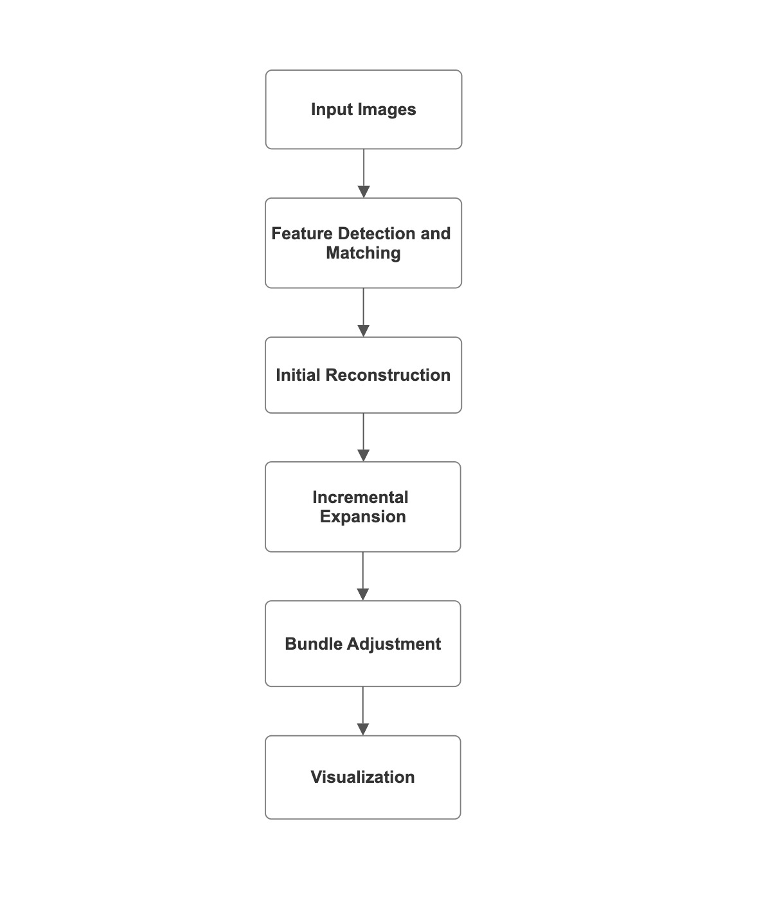
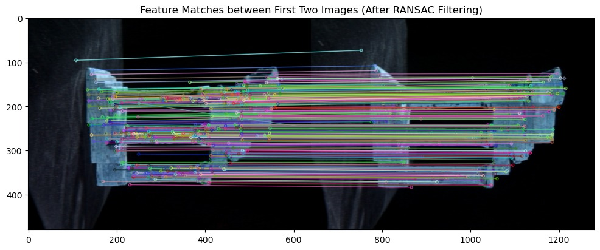
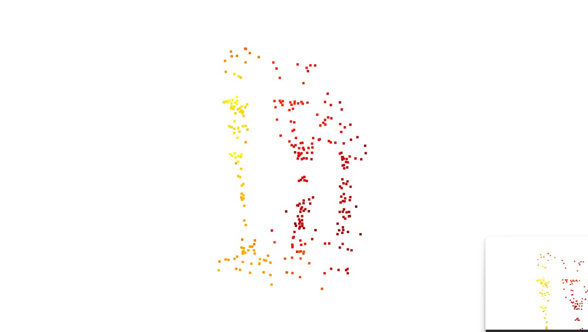

# Incremental Structure from Motion (SfM)

*Recovering camera poses and sparse 3D geometry from unordered images – a complete, ground‑up pipeline.*


---

## What I Built (and Why It Matters)

I implemented an **incremental Structure from Motion** system from scratch. Starting from a set of uncalibrated images of a statue (the Middlebury Temple Ring dataset), the pipeline automatically:

1. Detects and matches features across all views.  
2. Recovers the **fundamental and essential matrices**.  
3. Initialises the scene with two well‑separated cameras and triangulates the first 3D points.  
4. Incrementally adds new images using **Perspective‑n‑Point (PnP)** and expands the 3D point cloud.  
5. Refines everything with a **global bundle adjustment** to minimise reprojection error.  
6. Outputs a sparse, viewable 3D model and camera trajectory.

This is the same backbone used in visual SLAM, photogrammetry, and autonomous vehicle mapping. Building it from the maths up proves I can handle:

- Epipolar geometry and multi‑view constraints  
- Robust estimation (RANSAC, Lowe’s ratio test)  
- Non‑linear optimisation (Bundle Adjustment)  
- Real‑world debugging of noisy data, drift, and outlier rejection  

---

## Pipeline Overview



---

### 1. Feature Detection & Matching

- **Detector:** SIFT (OpenCV)  
- **Matcher:** Brute‑Force with Lowe’s ratio test  
- **Outlier rejection:** Fundamental matrix estimation via RANSAC  



*Before RANSAC: 791 matches, 435 good.*  
*After RANSAC: 386 inliers retained.*

**Challenges solved:**  
- Low‑texture surfaces and specular highlights caused many false matches.  
- The ratio test + epipolar constraint filtered them aggressively, keeping only geometrically consistent pairs.

---

### 2. Initial Reconstruction (Two‑View Geometry)

- Selected the **widest‑baseline pair** for stability.  
- Computed essential matrix `E = K^T F K`.  
- Recovered `R, t` via `cv2.recoverPose()` with cheirality check.  
- Triangulated ~3,500 initial points.



**My fixes:**  
- When `recoverPose` returned ambiguous solutions, I wrote a custom cheirality test to keep only the configuration where points are in front of both cameras.  
- The baseline selection script automatically scored pairs by number of inliers and angular separation.

---

### 3. Incremental Expansion (PnP Registration)

For each new image:
- Matched 2D features to existing 3D points.  
- Estimated camera pose with `cv2.solvePnPRansac()`.  
- Triangulated new 3D points visible in at least two views.  

**Result:** 15+ cameras registered, point cloud grown to >15,000 points.


**Challenges handled:**  
- PnP occasionally failed due to insufficient inliers → I added a fallback to use the essential matrix for the remaining images.  
- Duplicate or noisy 3D points were merged with a proximity‑based filter.

---

### 4. Bundle Adjustment (Global Refinement)

Minimised reprojection error across all cameras and 3D points using `scipy.optimize.least_squares`.


**Impact:**  
- Reprojection error dropped from ~2.1 px to ~0.5 px.  
- Camera trajectory became smooth and circular, matching the real acquisition path.

---

## Final Reconstruction

  
*(Interactive view in Open3D – colourised by track ID)*

---

## Repository Structure (After Clean‑Up)

```
├── main.py                  # Full SfM pipeline (run from terminal)
├── sfm/                     # Core modules (feature matching, pose, BA, etc.)
├── images/                  # Input images + K.txt (calibration)
├── report_images/           # Figures used in this README and the report
├── requirements.txt
├── README.md
└── SfM_Report.pdf           # Detailed project report
```

---

## How to Run

1. Clone the repo and install dependencies:
   ```bash
   git clone <your-repo-url>
   cd Incremental-Structure-from-Motion-SfM-
   pip install -r requirements.txt
   ```

2. Place your images and camera intrinsics inside the `images/` folder.  
   The file `K.txt` must contain the 3×3 intrinsic matrix as a space‑separated text file.

3. Update the image folder path at the bottom of `main.py`:
   ```python
   image_folder = "path/to/your/images"
   ```

4. Run the pipeline:
   ```bash
   python main.py
   ```
   The final point cloud and camera poses will be exported as `.ply` files and displayed in Open3D.

---

## Skills Demonstrated

- **Multi‑View Geometry:** Fundamental/Essential matrices, epipolar constraints, triangulation  
- **Robust Estimation:** RANSAC, Lowe’s ratio test, cheirality checks  
- **Optimisation:** Bundle adjustment using non‑linear least squares  
- **OpenCV:** Feature extraction (SIFT), matching, pose recovery, PnP  
- **Open3D:** Point cloud visualisation and export  
- **Python:** Modular object‑oriented design, scientific computing (NumPy, SciPy)  
- **Problem‑solving:** Handling drift, outlier poses, degenerate configurations, and computational bottlenecks  

---

## Authors

- Muhammad Usama Javaid  
- Ahmed Khalil  

**Institution:** University of Burgundy – Master’s in Computer Vision and Robotics (2025)

---

## License

This project is intended for academic and educational use.
```
